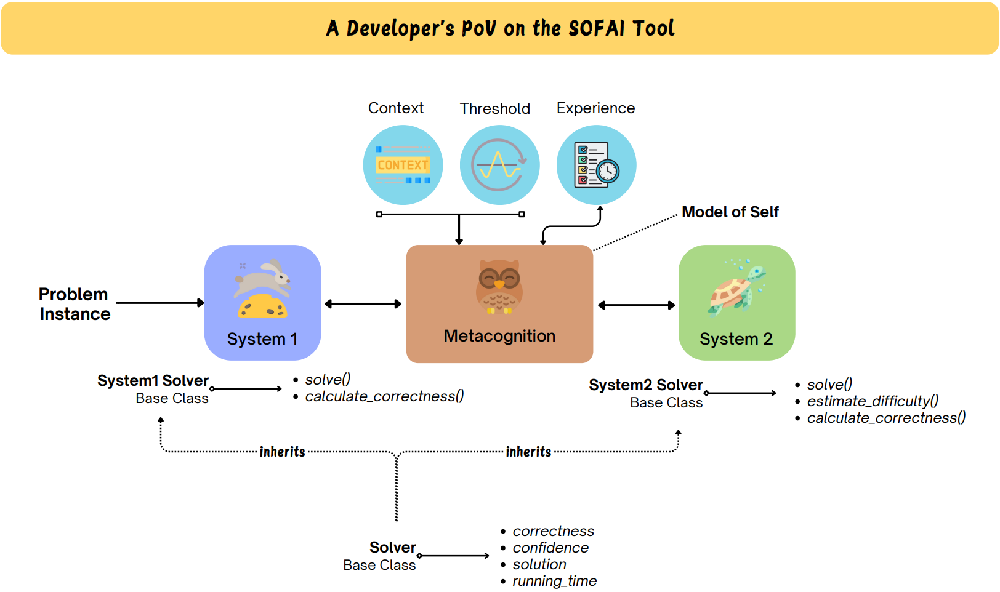

# SOFAI Tool

SOFAI Tool is a neurosymbolic system designed to integrate fast experience-based decision-making (System 1) with logical, deliberative processing (System 2) through a metacognition module. This package enables developers and researchers to easily instantiate, configure, and extend System 1 and System 2 solvers, log system activities, and visualize solver performance across a batch of problems.

## Features

- **Flexible Solver Architecture**: Define custom System 1 and System 2 solvers with problem-solving methods.
- **Metacognition Module**: A metacognition module that chooses between System 1 and System 2 based on set constraints.
- **Logging and Visualization**: Log solutions, confidence levels, and visualize the activities of System 1 and System 2 across multiple problems.



## Installation

Follow the steps below to install the SOFAI Tool:

1. **Create a Conda environment** (Python 3.10 recommended):
   ```bash
   conda create --name sofai_env python=3.10 -y
   conda activate sofai_env
   ```

2. **Clone the repository**:
   ```bash
   git clone https://github.com/ai4society/sofai_tool.git
   cd sofai_tool
   ```

3. **Install dependencies**:
   ```bash
   pip install .
   ```

4. **Verify installation**:
   ```bash
   python -c "import sofai; print('SOFAI Tool installed successfully!')"
   ```

### Optional: Installing in Development Mode
If you want to modify the package and test changes, install it in **editable mode**:
   ```bash
   pip install -e .
   ```

## Directory Structure

```
sofai_tool/
├── solvers/                   # Contains System 1 and System 2 solver templates
│   ├── system1.py             # System 1 solver base class
│   ├── system2.py             # System 2 solver base class
├── metacognition/             # Contains metacognition module
│   └── metacognition_module.py
├── utils/                     # Utility functions
│   ├── logger.py              # Logging functions
│   └── visualization.py       # Visualization functions
└── README.md                  # Project documentation
```

## Usage

The following examples demonstrate how to use the SOFAI Tool by importing the package as `sofai`.

```python
import sofai_tool as sofai
```

<!--- We might want to include the virtual envirnment activation on Debian/Ubunutu
python3 -m venv ~/py_envs
source ~/py_envs/bin/activate -- once created use this
deactivate --- to exit
-->

### 1. Define Custom Solvers

Define `System1Solver` and `System2Solver` by creating custom classes with problem-solving and (for System 1) confidence estimation methods.

```python
class CustomSystem1Solver(sofai.System1Solver):
    def solve(self, problem):
        # Define System 1 solving logic and return solution and confidence
        return 0.7,"solution1"
    
    def calculate_correctness(self, problem, solution):
        # Estimate correctness for System 1's solution
        return 0.9

class CustomSystem2Solver(sofai.System2Solver):
    def solve(self, problem):
        # Define System 2 solving logic
        return "solution2"
```

### 2. Metacognition: Choosing the Appropriate System

Use the `metacognition` function to select the solver based on System 1’s confidence level. If System 1’s confidence exceeds the threshold, its solution is chosen; otherwise, System 2 is used.

```python
# Instantiate solvers
system1_solver = CustomSystem1Solver()
system2_solver = CustomSystem2Solver()

# Define a problem
problem = "Example problem"

# Solve with System 1 and estimate confidence
s1_solution = system1_solver.solve(problem)
confidence = system1_solver.confidence_estimate(s1_solution)

# Use metacognition to decide final solution
final_solution = sofai.metacognition(s1_solution, confidence, problem, system2_solver, confidence_threshold=0.8)
print("Final Solution:", final_solution)
```

### 3. Logging Solutions and Confidence

Use the logging utilities to record solutions and confidence levels for each system.

```python
# Log System 1 solution and confidence
sofai.log_solution("System1", problem_id=1, solution=s1_solution)
sofai.log_confidence("System1", problem_id=1, confidence=confidence)
```

### 4. Visualizing Solver Activity

Visualize the activity of System 1 and System 2 across multiple problems.

```python
# Sample log data format
log_data = {
    "System1": [(1, 'solution1'), (2, 'solution2')],
    "System2": [(2, 'solution2_system2'), (3, 'solution3')]
}

# Plot activity
sofai.plot_solver_activity(log_data)
```

## Creating Instances of SOFAI Tool

SOFAI Tool provides a modular setup that enables users to adapt this system to build neurosymbolic architectures for problems of their choice. By implementing custom System 1 and System 2 solvers, you can model various types of decision-making systems. 

### Example Applications

[Graph Coloring, Planning, RL-based grid navigation notebooks go here]

## License

This project is licensed under the MIT License.
